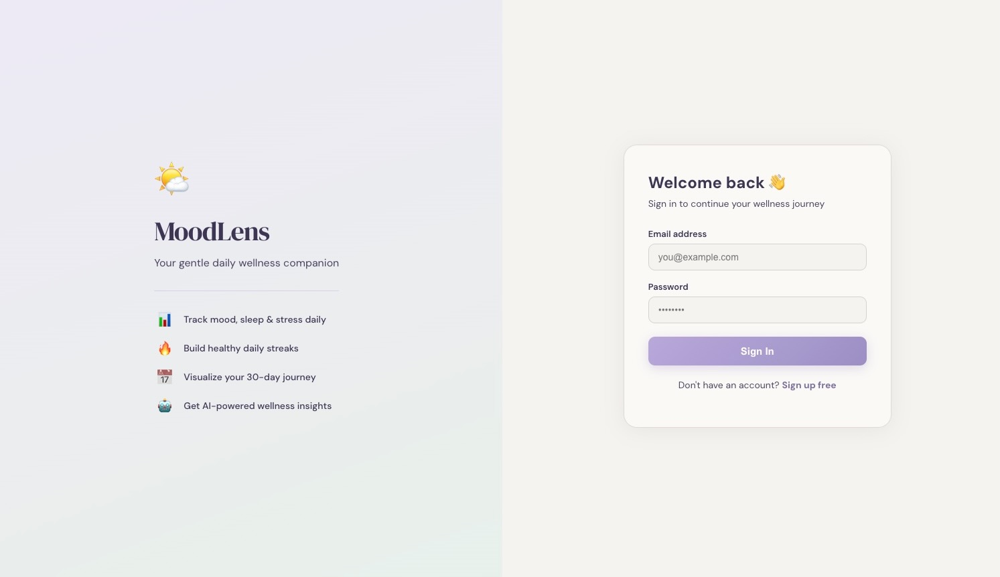
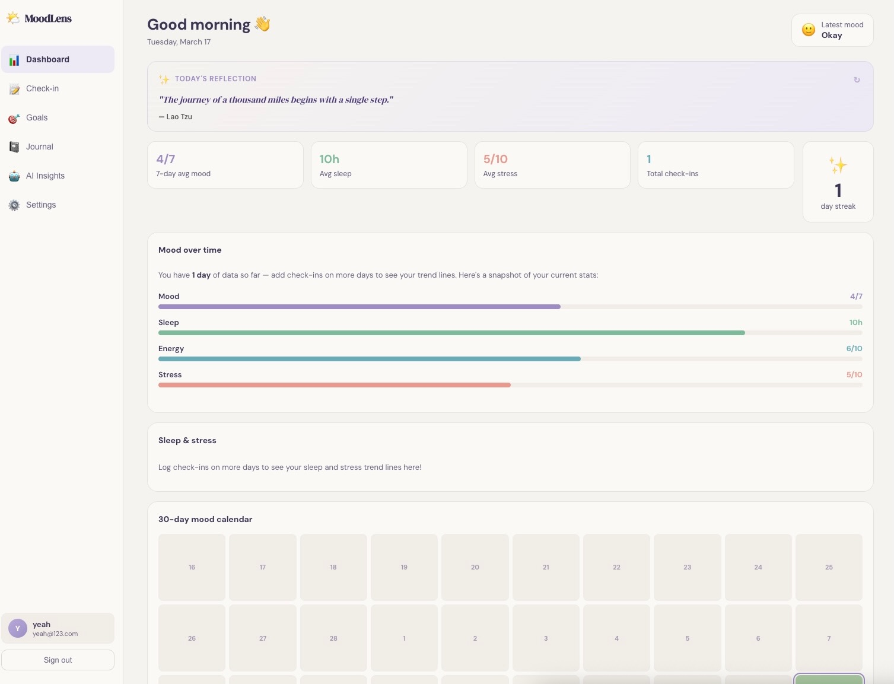
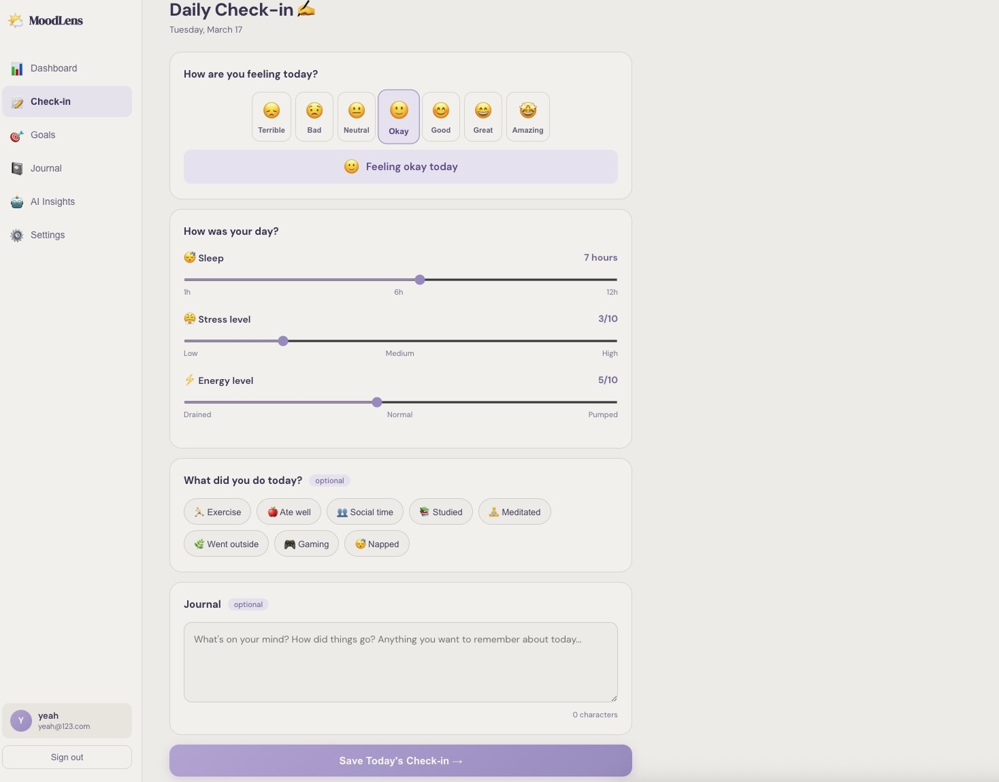
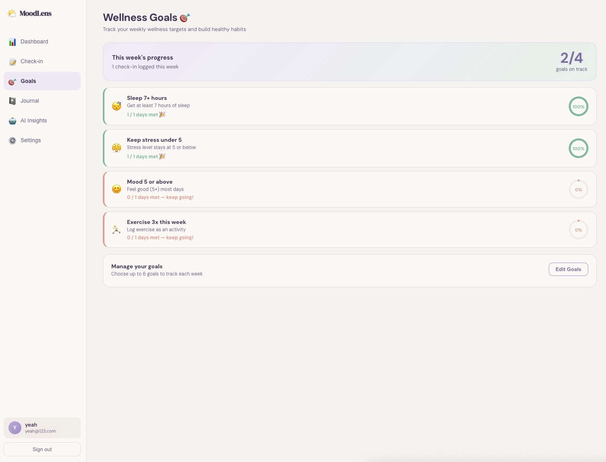
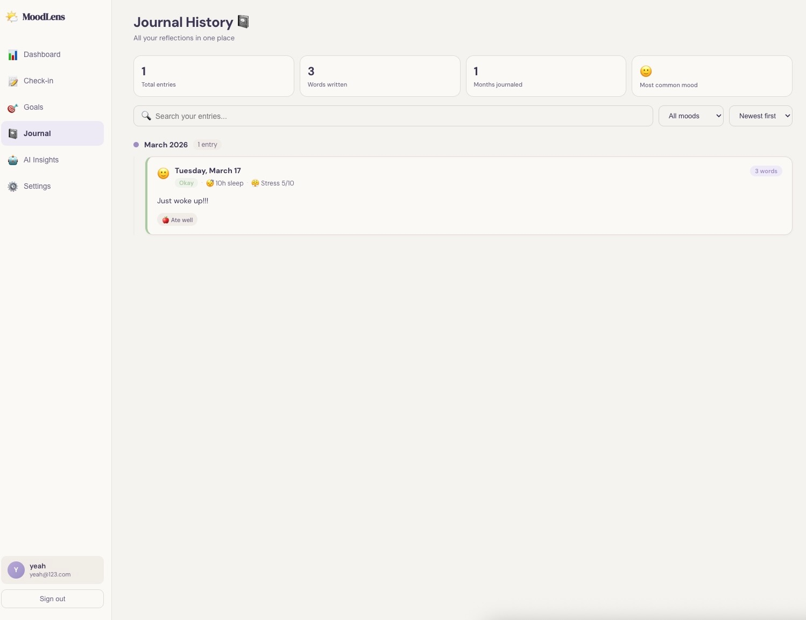
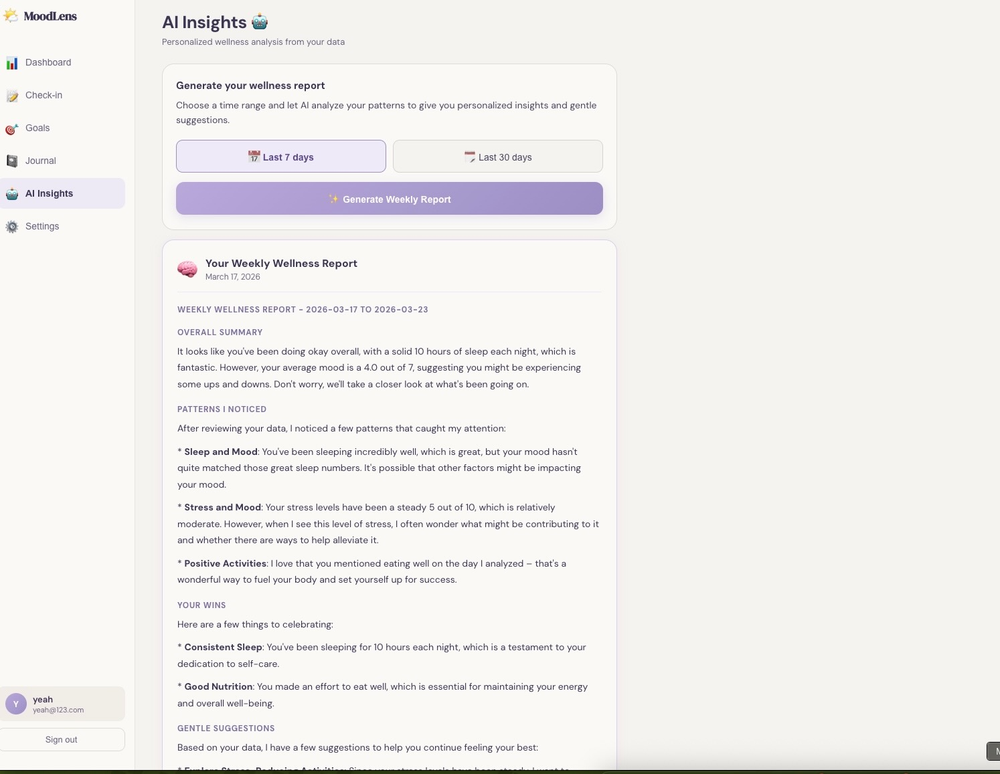
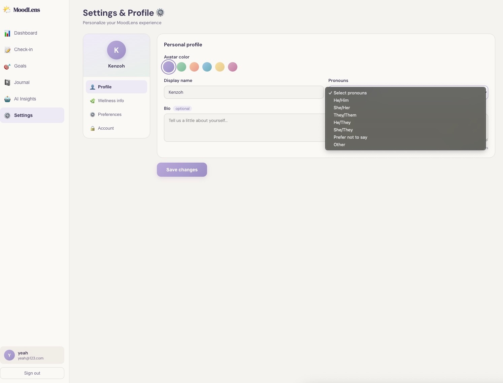

# 🌤️ MoodLens — AI-Powered Mental Wellness Tracker


## 🔗 Live Demo
**[moodlens.vercel.app](https://moodlens.vercel.app)** ← update this after deploying

---

## 📖 About

MoodLens is an AI-powered mental wellness tracking web application that allows users to log daily mood, sleep, stress, and energy data. The system uses large language model AI to analyze behavioral patterns and generate personalized weekly wellness insights — addressing mental health equity gaps in underserved college student populations.

**Research Question:** Can AI-detected behavioral patterns in self-reported mood data provide meaningful, personalized mental wellness insights for college students?

---

## ✨ Features

- 📝 **Daily Check-in** : Log mood (1–7), sleep, stress, energy, journal notes, and activity tags
- 📊 **Live Dashboard** : Area charts, streak tracker, and stat cards updating in real time
- 📅 **30-Day Mood Calendar** : Color-coded heatmap showing mood history at a glance
- 🎯 **Wellness Goals** : Set and track weekly wellness targets with circular progress rings
- 📓 **Journal History** : Searchable, filterable timeline of all past journal entries
- 🤖 **AI Insights** : Weekly and monthly wellness reports powered by Llama 3 via Groq API
- ✨ **Daily Quotes** : Personalized calming quotes based on current mood
- ⚙️ **Settings & Profile** : Rich user profile with university, major, pronouns, and wellness goals
- 🔐 **Authentication** : Secure login and signup via Firebase Auth

---

## 🛠️ Tech Stack

| Layer | Technology |
|---|---|
| Frontend | React.js, Recharts |
| Authentication | Firebase Auth |
| Database | Cloud Firestore |
| AI / LLM | Llama 3.1 via Groq API |
| Hosting | Vercel |

---

## 📸 Screenshots

### Login


### Dashboard


### Daily Check-in


### Wellness Goals


### Journal History


### AI Insights


### Settings & Profile


---

## 🚀 Getting Started

### Prerequisites
- Node.js 16+
- A Firebase project (free)
- A Groq API key (free at [console.groq.com](https://console.groq.com))

### Installation

```bash
# Clone the repo
git clone https://github.com/YOUR_USERNAME/moodlens.git
cd moodlens

# Install dependencies
npm install

# Create your environment file
cp .env.example .env
# Then fill in your keys in .env

# Start the app
npm start
```

### Environment Variables

Create a `.env` file in the root folder:

```
REACT_APP_GROQ_API_KEY=your_groq_api_key

REACT_APP_FIREBASE_API_KEY=your_firebase_api_key
REACT_APP_FIREBASE_AUTH_DOMAIN=your_project.firebaseapp.com
REACT_APP_FIREBASE_PROJECT_ID=your_project_id
REACT_APP_FIREBASE_STORAGE_BUCKET=your_project.appspot.com
REACT_APP_FIREBASE_MESSAGING_SENDER_ID=your_sender_id
REACT_APP_FIREBASE_APP_ID=your_app_id
```

---

## 🔒 Security Note

This project uses environment variables to protect all API keys. Never commit your `.env` file — it is listed in `.gitignore` by default.

---

##Author
Rochak Ghimire