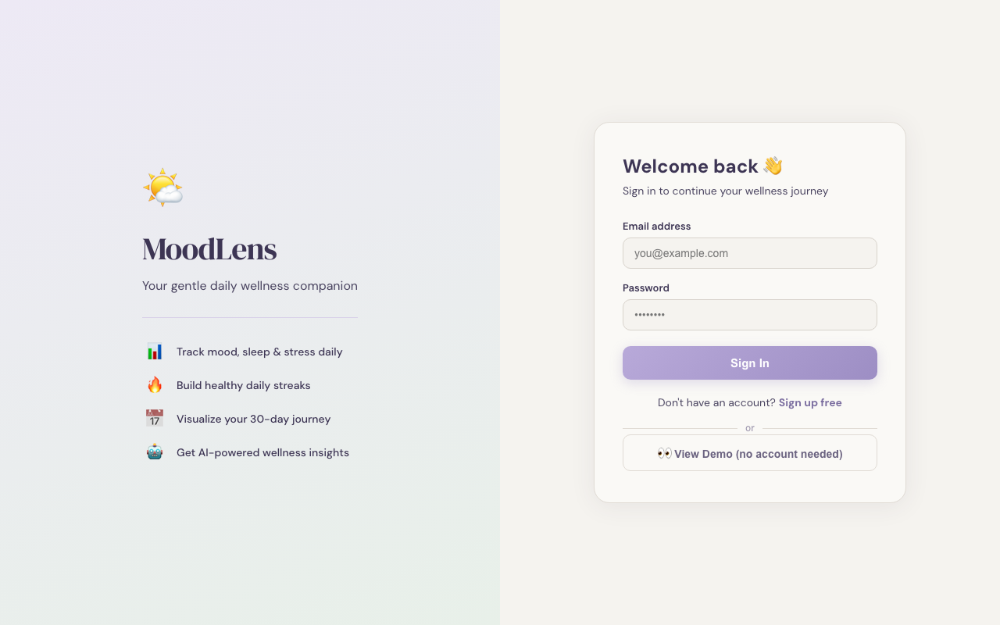
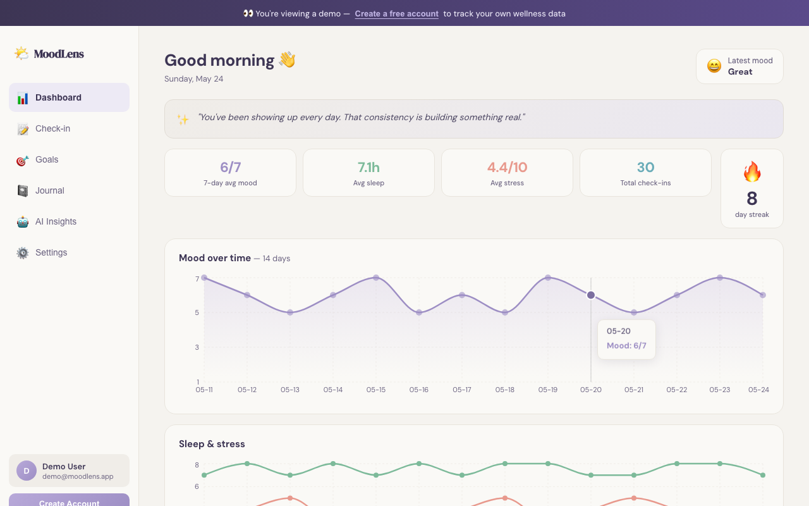
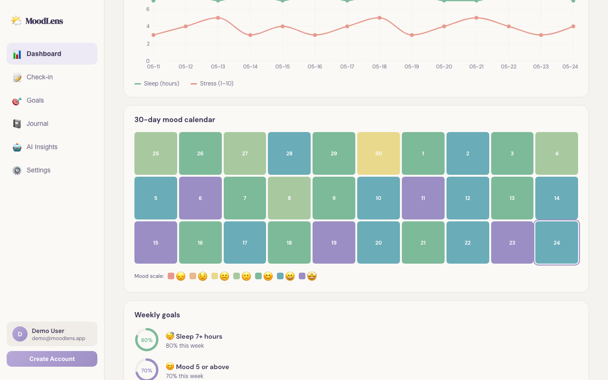
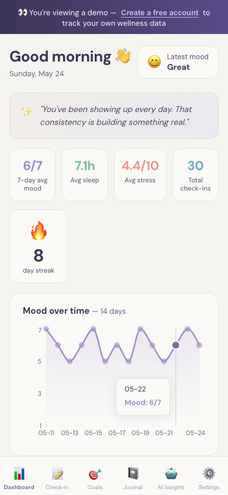

# MoodLens — AI-Powered Daily Wellness Tracker

> Track your mood, sleep, stress, and energy every day. Get personalized AI insights that help you understand your patterns and build healthier habits.

**[Live Demo →](https://moodlens-kappa.vercel.app/)**

---

## Screenshots

| Login | Dashboard |
|-------|-----------|
|  |  |

| 30-Day Mood Calendar | Mobile |
|----------------------|--------|
|  |  |

---

## Features

**Daily Check-In**
Log mood (1–7 scale), sleep hours, stress level, energy, a journal note, and activity tags. Takes under 60 seconds.

**Live Dashboard**
Area and line charts update in real time. Streak tracker, 7-day averages, and a color-coded 30-day mood heatmap give you a full picture of how you've been feeling.

**Wellness Goals**
Choose from preset goals (sleep 7+ hours, mood 5+, stress under 5, etc.) or set custom ones. Circular progress rings show weekly completion rates.

**Journal History**
Searchable, filterable timeline of every entry you've written. Filter by mood score, sort by date, and reflect on how far you've come.

**AI Insights**
Weekly and monthly wellness reports generated by Llama 3.1 via Groq API. Analyzes your mood patterns, sleep habits, and stress triggers. Cached locally so repeat views are instant.

**Guest Demo Mode**
New visitors can explore a fully interactive demo with 30 days of sample data before creating an account — no signup required.

**Error Boundaries & Skeletons**
Every tab is wrapped in an error boundary. Skeleton loaders replace blank states while data fetches.

---

## Tech Stack

| Layer | Technology |
|---|---|
| Frontend | React 19, Recharts |
| Auth | Firebase Auth (Email/Password) |
| Database | Cloud Firestore (offline persistence enabled) |
| AI / LLM | Llama 3.1-8B via Groq API |
| Hosting | Vercel |
| Fonts | DM Sans, DM Serif Display (Google Fonts) |

---

## Getting Started

### Prerequisites

- Node.js 18+
- A Firebase project ([free tier](https://firebase.google.com))
- A Groq API key ([free at console.groq.com](https://console.groq.com))

### Clone and install

```bash
git clone https://github.com/Kenzoh33/moodlens.git
cd moodlens
npm install
```

### Environment variables

Create a `.env.local` file in the project root:

```env
REACT_APP_FIREBASE_API_KEY=your_api_key
REACT_APP_FIREBASE_AUTH_DOMAIN=your_project.firebaseapp.com
REACT_APP_FIREBASE_PROJECT_ID=your_project_id
REACT_APP_FIREBASE_STORAGE_BUCKET=your_project.appspot.com
REACT_APP_FIREBASE_MESSAGING_SENDER_ID=your_sender_id
REACT_APP_FIREBASE_APP_ID=your_app_id
REACT_APP_GROQ_API_KEY=your_groq_api_key
```

### Firebase setup

1. Create a project at [console.firebase.google.com](https://console.firebase.google.com)
2. Enable **Email/Password** under Authentication → Sign-in method
3. Create a **Firestore Database** (start in production mode)
4. Add your deployment domain to Authentication → Settings → **Authorized domains**

### Run locally

```bash
npm start
# Opens at http://localhost:3000
```

### Production build

```bash
npm run build
```

---

## Project Structure

```
src/
├── firebase.js          # Firebase init with Firestore offline persistence
├── AuthContext.js       # Auth state provider with instant cached-user load
├── App.js               # Shell: lazy-loaded tabs, mobile nav, error boundaries
├── DemoApp.js           # Guest demo mode with 30 days of sample data
├── AuthPage.js          # Login / sign-up page
├── Dashboard.js         # Main dashboard: charts, streak, heatmap, journal preview
├── CheckIn.js           # Daily check-in form
├── Goals.js             # Weekly wellness goals with progress rings
├── JournalHistory.js    # Searchable journal entry timeline
├── AIInsights.js        # AI-generated weekly/monthly insights (cached)
├── Settings.js          # User profile settings
├── MoodQuote.js         # Mood-aware daily quote card
├── ErrorBoundary.js     # Per-tab error boundary
└── index.css            # Global styles, animations, mobile breakpoints
```

---

## Performance

- **Code splitting** — 8 lazy-loaded chunks; only the active tab's JS loads
- **Firestore offline persistence** — dashboard data served from IndexedDB instantly on repeat visits
- **Auth instant load** — cached user state means no loading splash for returning users
- **AI Insights cache** — Groq responses cached in localStorage per user/type/day
- **React.memo + useMemo** — expensive chart sub-components memoized

---

## Deploying to Vercel

1. Push to GitHub
2. Import the repo in [vercel.com](https://vercel.com)
3. Add all `REACT_APP_*` environment variables in Vercel → Settings → Environment Variables
4. Vercel auto-deploys on every push to `main`

---

## Security

- All API keys are stored as environment variables — never committed to source control
- `.env.local` is git-ignored by default in Create React App
- Firebase security rules should be configured to scope reads/writes to the authenticated user's UID

---

## Author

**Rochak Ghimire**
[github.com/Kenzoh33](https://github.com/Kenzoh33)
