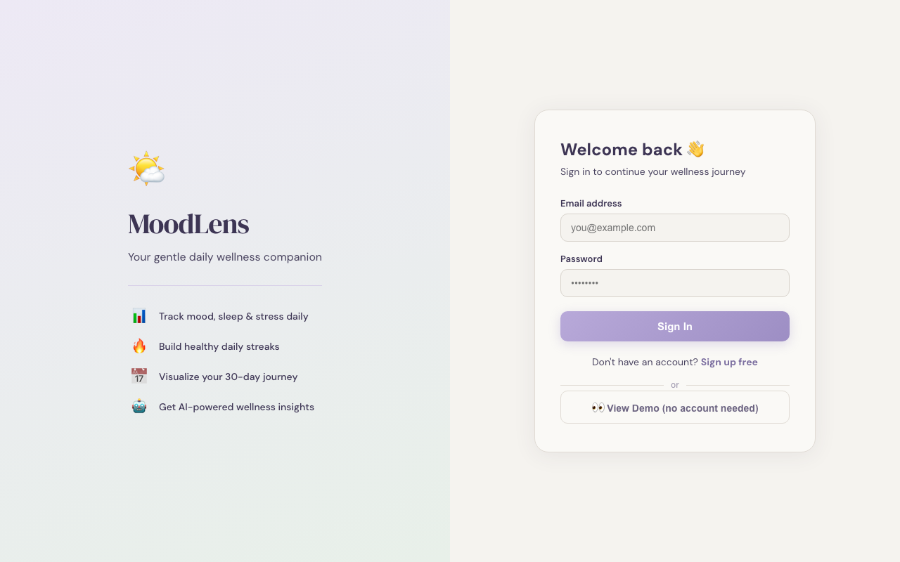
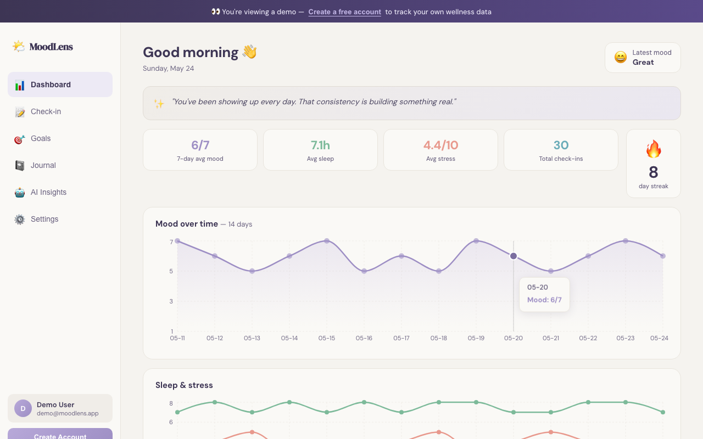
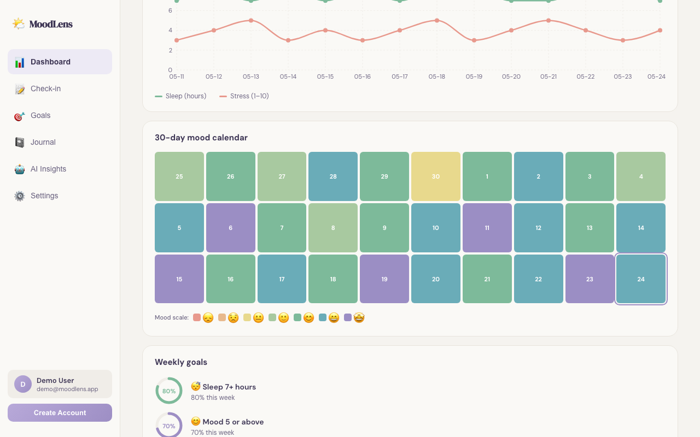
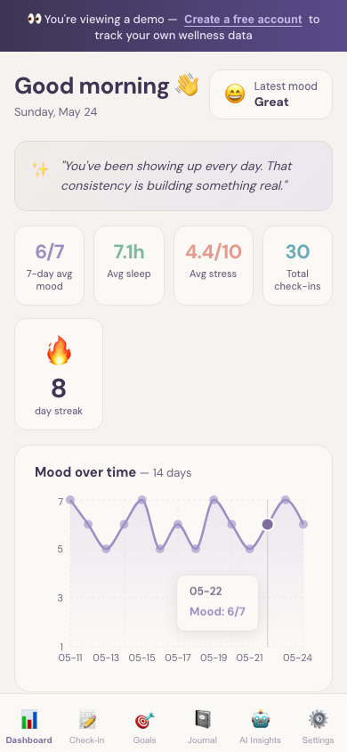

# MoodLens

**A daily wellness tracker that turns mood, sleep, stress, and energy logs into AI-generated insights.**

MoodLens lets you check in once a day in under a minute and builds a picture over time: a 30-day mood heatmap, streaks, weekly goal tracking, and a searchable journal. Weekly and monthly summaries are generated by Llama 3.1 through the Groq API and cached locally so repeat views load instantly.

**[Live Demo →](https://moodlens-kappa.vercel.app/)**


---

## Screenshots

| Login | Dashboard |
|-------|-----------|
|  |  |

| 30-Day Mood Calendar | Mobile |
|----------------------|--------|
|  |  |

---

## Features

**Daily check-in**
Mood (1–7 scale), sleep hours, stress level, energy, a journal note, and activity tags, in under 60 seconds.

**Live dashboard**
Area and line charts update in real time. Streak tracker, 7-day rolling averages, and a color-coded 30-day mood heatmap.

**Wellness goals**
Preset goals (sleep 7+ hours, mood 5+, stress under 5) or custom targets, tracked with circular weekly-completion progress rings.

**Journal history**
Searchable, filterable timeline of every entry. Filter by mood score, sort by date.

**AI insights**
Weekly and monthly reports generated by Llama 3.1 via the Groq API, analyzing mood patterns, sleep habits, and stress triggers. Responses are cached locally so repeat views are instant and don't re-trigger an API call.

**Guest demo mode**
A fully interactive demo preloaded with 30 days of sample data, so new visitors can explore the app before creating an account.

**Error boundaries & skeleton states**
Every tab is wrapped in its own error boundary; skeleton loaders replace blank states while data fetches, instead of a blank screen or a full-page crash.

---

## Tech Stack

| Layer | Technology |
|---|---|
| Frontend | React 19, Recharts |
| Auth | Firebase Auth (email/password) |
| Database | Cloud Firestore, offline persistence enabled |
| AI / LLM | Llama 3.1-8B via Groq API |
| Hosting | Vercel |
| Fonts | DM Sans, DM Serif Display (Google Fonts) |

---

## Getting Started

### Prerequisites

- Node.js 18+
- A Firebase project ([free tier](https://firebase.google.com))
- A Groq API key ([free at console.groq.com](https://console.groq.com))

### Clone and install

```bash
git clone https://github.com/Kenzoh33/moodlens.git
cd moodlens
npm install
```

### Environment variables

Create a `.env.local` file in the project root:

```env
REACT_APP_FIREBASE_API_KEY=your_api_key
REACT_APP_FIREBASE_AUTH_DOMAIN=your_project.firebaseapp.com
REACT_APP_FIREBASE_PROJECT_ID=your_project_id
REACT_APP_FIREBASE_STORAGE_BUCKET=your_project.appspot.com
REACT_APP_FIREBASE_MESSAGING_SENDER_ID=your_sender_id
REACT_APP_FIREBASE_APP_ID=your_app_id
REACT_APP_GROQ_API_KEY=your_groq_api_key
```

### Firebase setup

1. Create a project at [console.firebase.google.com](https://console.firebase.google.com).
2. Enable **Email/Password** under Authentication → Sign-in method.
3. Create a **Firestore Database** (start in production mode).
4. Add your deployment domain under Authentication → Settings → **Authorized domains**.
5. Set your Firestore security rules so each user can only read and write their own data. See [Security](#security) below for a starting template.

### Run locally

```bash
npm start
# Opens at http://localhost:3000
```

### Production build

```bash
npm run build
```

---

## Project Structure

```
src/
├── firebase.js          # Firebase init with Firestore offline persistence
├── AuthContext.js       # Auth state provider with instant cached-user load
├── App.js               # Shell: lazy-loaded tabs, mobile nav, error boundaries
├── DemoApp.js            # Guest demo mode with 30 days of sample data
├── AuthPage.js           # Login / sign-up page
├── Dashboard.js          # Main dashboard: charts, streak, heatmap, journal preview
├── CheckIn.js            # Daily check-in form
├── Goals.js               # Weekly wellness goals with progress rings
├── JournalHistory.js      # Searchable journal entry timeline
├── AIInsights.js          # AI-generated weekly/monthly insights (cached)
├── Settings.js            # User profile settings
├── MoodQuote.js           # Mood-aware daily quote card
├── ErrorBoundary.js       # Per-tab error boundary
└── index.css              # Global styles, animations, mobile breakpoints
```

---

## Performance

- **Code splitting** — 8 lazy-loaded chunks; only the active tab's JS loads.
- **Firestore offline persistence** — dashboard data served from IndexedDB instantly on repeat visits.
- **Auth instant load** — cached user state means no loading splash for returning users.
- **AI insights cache** — Groq responses cached in localStorage per user/type/day, so a repeat view costs nothing and loads instantly.
- **Memoization** — expensive chart sub-components wrapped in `React.memo` and `useMemo`.

---

## Deploying to Vercel

1. Push to GitHub.
2. Import the repo in [vercel.com](https://vercel.com).
3. Add all `REACT_APP_*` environment variables under Vercel → Settings → Environment Variables.
4. Vercel auto-deploys on every push to `main`.

---

## Security

**In this deployment**
- API keys are stored as environment variables and are never committed to source control.
- `.env.local` is git-ignored by default in Create React App.
- Firestore security rules are locked down so that all reads and writes are scoped to the authenticated user's own UID. One account cannot read or write another account's mood, journal, or check-in data.

**If you clone this repo and connect your own Firebase project**
Firebase projects don't inherit rules from anywhere else, so you'll need to set your own before storing real data. A per-user rule set to start from:

```
rules_version = '2';
service cloud.firestore {
  match /databases/{database}/documents {
    match /users/{userId}/{document=**} {
      allow read, write: if request.auth != null && request.auth.uid == userId;
    }
  }
}
```

Adjust the collection path to match your schema, and test it in the Firebase console's Rules Playground before deploying.

---

## Author

**Rochak Ghimire**
[github.com/Kenzoh33](https://github.com/Kenzoh33)
